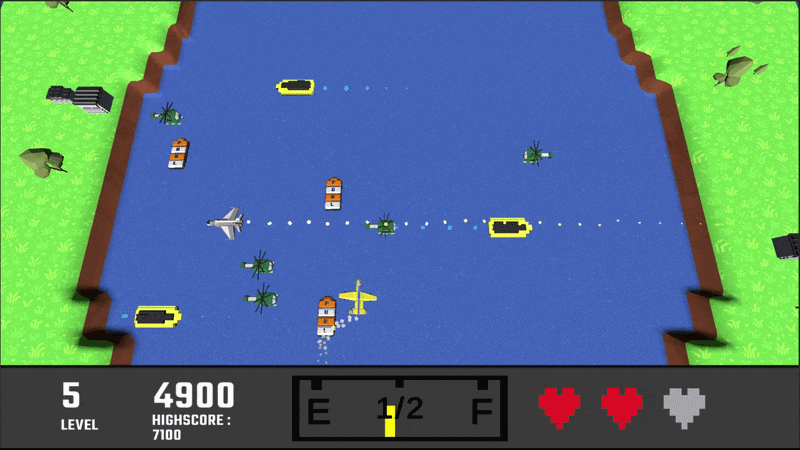
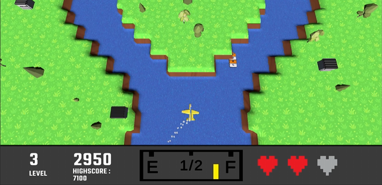

# River Raid Clone 

A River Raid–inspired 2.5D topdown shooter built in Unity, designed as my third mini project to explore procedural generation, 3D workflows, and performance optimization. This project shifts from simple looping gameplay to dynamically generated environments, where the player navigates an endlessly spawning river filled with obstacles, enemies, and resource management challenges. This project was primarily built to deepen my understanding of:

- Procedural Generation: Dynamically spawning river segments with varying layouts.
- Controlling difficulty through generation rules and ensuring playable paths and avoiding impossible scenarios.
- Object Pooling using the Flyweight pattern - Replacing frequent instantiation/destruction with efficient reuse of obstacles, enemies, and environment tiles.
- 2.5D Top-down gameplay using simple, stylized 3D assets modelled in Blender and exported and integrated into Unity.
- Introduction to Unity Shader Graph for custom materials and water graphics.

## Gameplay 
Use WASD to navigate a jet through a procedurally generated river, avoid terrain, enemy units, and environmental hazards. Press Space to fire missiles to destroy enemies and bridges to earn points and avoid collision.
Manage fuel by collecting it by hovering over fuel depots, running out of fuel will cost a life. Survive for as long as possible while difficulty increases over time. 

Clone and build this project in Unity to Play:
### `https://github.com/SaedulH/Mini-Game-3---River-Raid.git`

 

## Key Systems
- Procedural River Generation: Each Level is built as modular segments that use perlin noise to create a width trend that is mirrored to create a symmetrical river. Segments selected based on rules (width, obstacle density, turns), with every third level containing a split of the river to create two paths. For each level, the available posiitons on the river are cycled through and an enemy or fuel depot is randomly spawned.

- Object Pooling System: Since a large amount of objects are spawned per level, a centralized pooling was utilised that uses a 'Flyweight Factory' that handles Entities, Projectiles and Items (Flyweights). This significantly reduces garbage collection spikes and runtime instantiation costs.  

- Visual Pipeline: Low-poly assets modeled in Blender and simple materials used for all surfaces and objects. In combination with audio Effects, animations and particle systems, this enhanced the feedback to the player. A basic shader graph was created for the river water, using perlin noise and offset to simulate moving water.

## Challenges
- Designing procedural rules that feel random but fair
- Preventing impossible or cramped layouts
- Managing object lifecycle cleanly with pooling
- Maintaining visual clarity in a 2.5D perspective
- Learning the full pipeline from model → texture → shader → engine

## Future Considerations
- Add biome variation (different river themes)
- Improve procedural logic with weighted randomness or noise to create a more realistic river trend
- Introduce enemy AI behaviors
- Expand shader work (water effects, lighting polish)
- Add progression systems (fuel, scoring depth, upgrades)
- optimise mesh generation and entity population using multithreading.
- Improve and implenent more UI options (pause menu, settings etc.).
